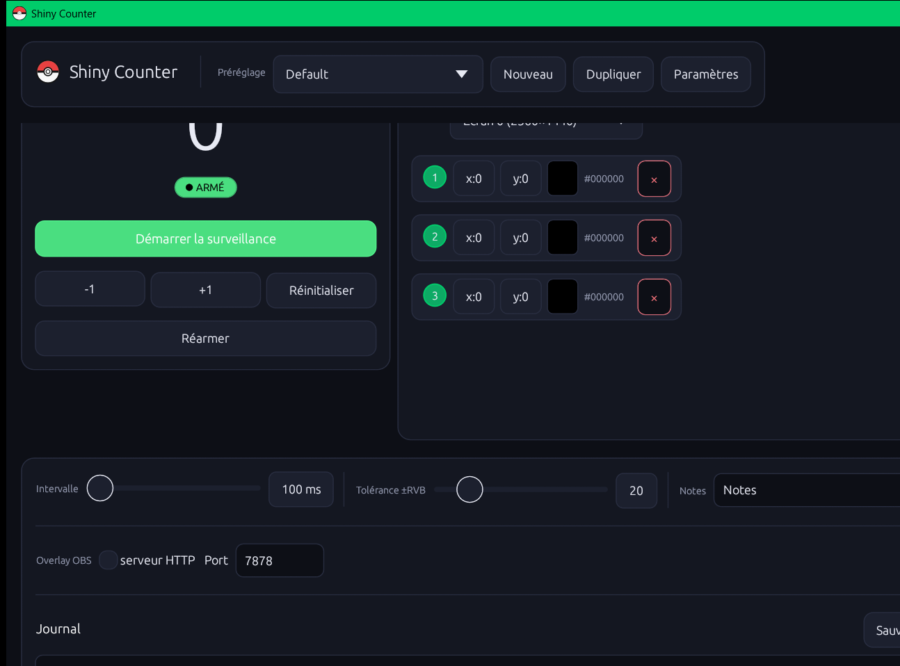

# Shiny Counter

A native, cross-platform desktop counter for **shiny Pokémon hunts**, written
in Rust with [egui](https://github.com/emilk/egui). Pure Rust, single binary,
no Electron, no browser.

<p align="center">
  
</p>

---

## 🇫🇷 Présentation (Français)

### À quoi ça sert

Quand on chasse un shiny — sur Switch, GBA, émulateur, n'importe quel jeu
Pokémon en stream — on enchaîne **des centaines, parfois des milliers de soft
resets**. Tenir le compte à la main est pénible et la lecture OCR de l'écran
est fragile.

Shiny Counter **lit la couleur de pixels précis de ton écran** (3 à 8 pipettes
configurables) et incrémente automatiquement un compteur dès que **toutes les
pipettes matchent simultanément** la « signature » d'une rencontre Pokémon.
Une machine d'état évite que le compteur s'emballe tant que l'image reste à
l'écran : il faut que **toutes les pipettes voient des couleurs différentes**
(retour au noir entre deux rencontres, par exemple) avant de pouvoir compter
de nouveau.

### Fonctionnalités

- 🎯 **3 à 8 pipettes** posées visuellement sur un screenshot, ou aux coordonnées
- 🧪 **Tolérance RVB** réglable (±0 à ±128) pour s'adapter aux compressions de stream
- 🔁 **Compteur** avec +1 / -1 / réinitialisation et réarmement manuel
- 📚 **Préréglages** par jeu / Pokémon avec couleur d'accent personnalisable
- 🪟 **Capture d'écran complet** (multi-moniteur) **ou de fenêtre** (même cachée,
  via `PrintWindow` sur Windows)
- 📊 **Historique par session** (chaque cycle Start/Stop) avec durée + paginé
- 📝 **Journal de notes** paginé, suppression et restauration de compteur
- 🌐 **Overlay HTTP** pour OBS : ajoute `http://127.0.0.1:7878/` en Browser
  Source pour afficher le compteur (texte brut) sur la diffusion
- 🌍 **Français / Anglais** auto-détecté, modifiable en direct
- 🎨 **Couleur d'accent** détectée automatiquement (couleur Windows / macOS)
- 💾 **Sauvegarde automatique** atomique de la configuration

### Installation

#### Téléchargement direct (recommandé)

Récupère le binaire pour ta plateforme depuis la
[page des Releases](https://github.com/DylanBricar/ShinyCounter/releases/latest) :

| Plateforme        | Fichier                                         |
| ----------------- | ----------------------------------------------- |
| Windows x86_64    | `ShinyCounter-<version>-windows-x86_64.zip`     |
| macOS Apple Silicon | `ShinyCounter-<version>-macos-aarch64.dmg`    |
| macOS Intel       | `ShinyCounter-<version>-macos-x86_64.dmg`       |
| Linux x86_64      | `ShinyCounter-<version>-linux-x86_64.tar.gz`    |
| Linux aarch64     | `ShinyCounter-<version>-linux-aarch64.tar.gz`   |

#### Compiler depuis les sources

```bash
git clone https://github.com/DylanBricar/ShinyCounter.git
cd ShinyCounter
cargo build --release
./target/release/shiny_counter      # Linux / macOS
./target/release/shiny_counter.exe  # Windows
```

Dépendances Linux (X11 + Wayland) :

```bash
sudo apt install libxkbcommon-dev libgtk-3-dev libxcb1-dev libx11-dev \
  libxrandr-dev libxinerama-dev libxcursor-dev libxi-dev libwayland-dev \
  libgl1-mesa-dev libfontconfig1-dev
```

### Comment ça marche

1. Lance Shiny Counter. Choisis la **Source** (ton moniteur, ou la fenêtre du
   jeu / de l'émulateur).
2. Clique **Choisir à l'écran** : l'app capture la source et te demande de
   cliquer 3 fois sur le screenshot pour placer les pipettes. Chaque clic
   échantillonne la couleur du pixel cible.
3. Clique **Valider** : les pipettes sont posées, leurs couleurs cibles
   enregistrées dans le préréglage actif.
4. Ajuste **Intervalle** (durée entre deux échantillonnages, défaut 100 ms) et
   **Tolérance ±RVB** (défaut 20).
5. Clique **Démarrer la surveillance**. Le compteur s'incrémente dès qu'une
   rencontre est détectée.
6. Pour OBS : active **serveur HTTP** dans la section Overlay et ajoute
   `http://127.0.0.1:7878/` comme Browser Source.

### Où sont stockées les données

Une configuration JSON unique, écrite de manière atomique :

| OS      | Emplacement                                                          |
| ------- | -------------------------------------------------------------------- |
| Windows | `%APPDATA%\ShinyCounter\config.json`                                 |
| macOS   | `~/Library/Application Support/ShinyCounter/config.json`             |
| Linux   | `$XDG_CONFIG_HOME/ShinyCounter/config.json` (ou `~/.config/...`)     |

Le fichier contient tes préréglages, l'historique des sessions et le journal.
Aucune autre donnée n'est créée. Tu peux le sauvegarder, le déplacer entre
machines, ou le supprimer pour repartir à zéro.

---

## 🇬🇧 Overview (English)

### What it does

When hunting a shiny Pokémon — on Switch, GBA, an emulator, anything you
stream — you run **hundreds, sometimes thousands of soft resets**. Counting
manually is painful, and OCR on the screen is brittle.

Shiny Counter **reads the colour of a few pixels on your screen** (3 to 8
configurable pickers) and bumps an encounter counter every time **all pickers
match** the configured signature simultaneously. A small state machine keeps
the counter sane: it can only fire again once **every picker has read a
different colour** (i.e. the encounter screen has gone away).

### Features

- 🎯 3 to 8 pickers, placed visually on a screenshot or by raw coordinates
- 🧪 RGB tolerance (±0 to ±128) to handle stream compression artifacts
- 🔁 Counter with +1 / -1 / reset and manual rearm
- 📚 Per-game / per-Pokémon presets with a custom accent colour
- 🪟 Capture from a **monitor** or any **window** (even occluded — uses
  `PrintWindow` on Windows)
- 📊 History grouped by **session** (each Start/Stop cycle) with duration and
  pagination
- 📝 Paginated note journal, with per-entry delete and counter restore
- 🌐 Built-in **HTTP overlay** for OBS: drop
  `http://127.0.0.1:7878/` into a Browser Source to display the count
- 🌍 French / English UI, picked from settings
- 🎨 Accent colour auto-detected from your OS (Windows / macOS)
- 💾 Atomic JSON config save

### Install

Grab the latest pre-built binary from
[Releases](https://github.com/DylanBricar/ShinyCounter/releases/latest), or
build from source:

```bash
git clone https://github.com/DylanBricar/ShinyCounter.git
cd ShinyCounter
cargo build --release
```

Linux build deps:

```bash
sudo apt install libxkbcommon-dev libgtk-3-dev libxcb1-dev libx11-dev \
  libxrandr-dev libxinerama-dev libxcursor-dev libxi-dev libwayland-dev \
  libgl1-mesa-dev libfontconfig1-dev
```

### How to use

1. Launch Shiny Counter. Pick a **Source** (your monitor, or the game window).
2. Click **Pick on screen**: the app captures the source, then asks you to
   click 3 spots on the screenshot. Each click samples the colour of that
   pixel.
3. Click **Apply**: the pickers are stored on the active preset.
4. Tune the **Interval** (sampling cadence, default 100 ms) and **Tolerance
   ±RGB** (default 20).
5. Click **Start watching**. The counter bumps whenever an encounter is
   detected.
6. For OBS: enable the **HTTP server** in the Overlay section, then add
   `http://127.0.0.1:7878/` as a Browser Source.

### Where data lives

A single JSON config file, written atomically:

| OS      | Path                                                                  |
| ------- | --------------------------------------------------------------------- |
| Windows | `%APPDATA%\ShinyCounter\config.json`                                  |
| macOS   | `~/Library/Application Support/ShinyCounter/config.json`              |
| Linux   | `$XDG_CONFIG_HOME/ShinyCounter/config.json` (or `~/.config/...`)      |

Holds your presets, session history and journal. No other state is written.
Copy it between machines, back it up, or delete it to start fresh.

---

## Technical notes

- **Sampling cost** is O(pickers) per tick — typically 3 reads per second at
  default interval. The app captures a full frame, then reads 3 pixels and
  drops the frame. Memory footprint stays small even after hours.
- **Background HTTP** runs in a single dedicated worker thread and is joined
  on shutdown.
- History caps: 500 sessions per preset, 10 000 hits per session, 500 entries
  in the journal — older entries are dropped automatically.
- Counter state machine has full **unit + integration test coverage**
  (`cargo test`).
- CI runs `cargo fmt --check`, `cargo clippy -D warnings` and the full test
  suite on every PR.
- Release builds use `lto = "fat"`, `codegen-units = 1`, `strip = "symbols"`
  and `panic = "abort"` for the smallest, fastest binary.

## Build & release pipeline

Pushing to `main` triggers the [release workflow](.github/workflows/release.yml):

1. Computes the next semver patch from existing tags.
2. Generates a Conventional-Commits style changelog.
3. Builds matrix targets (Linux x86_64 / aarch64, Windows x86_64, macOS
   x86_64 / Apple Silicon).
4. Packages a `.tar.gz` / `.zip` / `.dmg` per platform.
5. Uploads everything to a fresh GitHub Release and publishes it.

## License

[MIT](LICENSE) © DylanBricar.

Pokémon is a trademark of Nintendo / Game Freak. This project is unaffiliated
and provided for the streaming / speedrun community.
